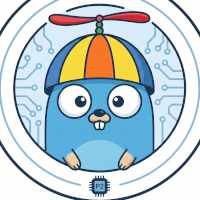

*Mascot based on the [Go gopher](https://go.dev/blog/gopher) by Renée French, licensed [CC BY 4.0](https://creativecommons.org/licenses/by/4.0/).*

**A modern, zero-allocation, Go-like programming language built specifically for the Parallax Propeller 2 (P2) multi-core microcontroller.**

OctoGo brings the elegance of Go's concurrency model to embedded hardware. It compiles a  LL(1) subset of a Go-like language into C99/C11, which is then compiled to native P2 assembly using the industry-standard flexprop toolchain.

There is no software scheduler and no garbage collector. Goroutines map 1:1 to physical silicon.

The repository you are currently viewing might be a mirror. Please review the guidelines below based on where you are viewing this:

| Platform | Role | Contributing Guidelines |
| :--- | :--- | :--- |
| **GitLab** | **Primary Source** | This is the canonical repository (`cznic/ogo`). CI pipelines and main development happen here. |
| **GitHub** | **Mirror** | This is a mirror (`modernc-org/ogo`). We **do accept** Issues and Pull Requests here for your convenience! <br> *Note: PRs submitted here will be manually merged into the GitLab source, so please allow extra time for processing.* |

### **The Hook: Concurrent Blinky**

Forget manual state machines and timer interrupts. In OctoGo, spawning a parallel hardware process is as simple as calling go myfunc(). Channel communication uses the familiar \<- operator, allowing you to synchronize hardware locks seamlessly.

```

import "p2"

// blinkWorker runs independently on its own dedicated Cog
func blinkWorker(pin int, rateChan chan int) {
    delay := 500
    for {
        // Non-blocking hardware poll via select
        select {
        case delay = <-rateChan:
        default:
        }

        p2.PinHigh(pin)
        p2.WaitMs(delay)
        p2.PinLow(pin)
        p2.WaitMs(delay)
    }
}

func main() {
    // A channel is created by its declaration. OctoGo has no allocator, so
    // make(chan int) is rejected: the declaration is what allocates the
    // rendezvous cell and acquires its hardware lock.
    var rateChan chan int

    // Spawns directly to a new hardware Cog!
    go blinkWorker(56, rateChan)

    // Update the blink rate from the main Cog via hardware-locked channel
    rateChan <- 100
}
```

## **Architecture & Design**

OctoGo is designed to be a zero-cost abstraction over the Propeller 2's unique 8-cog architecture.

* **Native Hardware Concurrency:** The go keyword transpiles to a scoped block that claims a pooled slot holding the goroutine's stack and its arguments, then invokes \_cogstart\_C. The pool has one slot per available Cog, so the P2's 8-cog limit is enforced by construction; exceeding it is a runtime panic.

* **Hardware-Backed Channels:** Channels (chan) are not software queues. Each is a rendezvous cell in Hub RAM guarded by one of the P2's native hardware locks (0-15), giving atomic, lock-step transfer. A channel is created by its declaration, not by make: there is no allocator to make it with.  
* **Zero-Allocation & No GC:** OctoGo operates without a Garbage Collector. Memory scoping is strict (Hub RAM vs. Cog RAM), and slices are implemented as non-escaping views over fixed arrays.  
* **Select Statements:** The select statement  is transpiled into an efficient polling loop, utilizing flexprop's \_waitx yield instructions to prevent bus starvation during non-blocking hardware polling.

* **Implicit Namespaces:** To keep the grammar clean and strictly LL(1), there is no package keyword. A package's namespace is implicitly inferred from its directory name, mapping cleanly to a single C translation unit.

## **The Compiler Pipeline**

OctoGo is a source-to-source compiler (transpiler) written in Go.

1. **Frontend:** Lexical analysis and parsing are generated via modernc.org/egg using a LL(1) grammar. The AST is represented as a zero-pointer, cache-local flat \[\]int32 slice.

2. **Semantic Pass:** Uses Go 1.23+ iterators (`func(yield func(node) bool)`) to traverse the AST, calculate memory offsets, and resolve scope.  
3. **Transpilation:** Emits standard C. The runtime it needs -- bounds and divide-by-zero traps, slice and channel helpers, the goroutine pool -- is emitted into the same file, per program, so only what is used is paid for.  
4. **Backend Generation:** The ogo build command automatically feeds the emitted C into flexprop, delegating register allocation, instruction scheduling, and P2 binary generation to a proven, hardware-aware backend.

## **Getting Started**

1. Issue `go install modernc.org/ogo@latest`
2. Write your .ogo code.
3. Run `ogo build blinky/` to compile and generate your P2 binary.
4. Run `ogo run blinky/` to compile it, load it onto a connected board and open a terminal.

That is the whole toolchain. `ogo` embeds the C backend (flexspin's compiler,
transpiled to Go) and the P2 loader, so there is no flexprop installation, no
separate loader and no SDK path to configure.

## **Status: early preview**

OctoGo compiles and runs real programs on real Propeller 2 hardware, and every
change is verified by a suite that builds each test program with the real backend,
loads it onto a P2 and checks its serial output. It is also unfinished. This
section is the honest inventory — please read it before deciding the compiler is
broken.

**Works** (all of it exercised on hardware):

* Integers (sized and unsized), `byte`, `rune`, `bool`, `string`, structs, fixed
  arrays including multi-dimensional, slices, named types, channels.
* `var` (including several names and a value list), `const` with `iota`, `type`,
  functions and methods with value or pointer receivers.
* Named and unnamed parameters and results, multiple return values, naked returns.
* `if`/`else`, all `for` forms including `range`, `switch` with or without a guard,
  `break`, `continue`, `defer` (including in nested blocks, capturing its arguments).
* The full operator set, compound assignment, multiple assignment.
* `len`, `cap`, `append`, `make` for a fixed-capacity slice, `print`/`println`.
* `go`, `chan` and `select`, mapped to cogs and hardware locks.
* Runtime traps for out-of-range indexing, division by zero and cog exhaustion.
* A package is a directory: `ogo build` compiles every `.ogo` file in it together.

**Does not work yet**, in rough order of how likely you are to hit it:

* **Composite literals.** `p := Point{1, 2}` does not parse. Write
  `var p Point; p.x = 1` instead. This is the one that will annoy you first, and it
  is a consequence of keeping the grammar strictly LL(1) — the `{` after a type name
  is ambiguous with a block, which Go resolves with parser context an LL(1) grammar
  cannot express. Not a decision I am happy with, and not a settled one.
* **Importing your own packages.** Only `import "p2"` resolves; a program is one
  package in one directory for now.
* **`ogo test`** is not implemented, and neither is `ogo help`.
* **The `p2` package** wraps nine intrinsics (pin control, smart pins, `WaitMs`).
  It is enough for blinky, not a standard library.
* `go` on a method, and send clauses in `select`.
* Package-level channels, which need an initialization pass that does not exist.
* An array as a function result, and slicing a multi-dimensional array.

**Not planned**, because the target does not permit them: a garbage collector, a
heap, maps, floating point, closures that capture their environment, and runtime
string concatenation. Constant string concatenation folds at compile time.

Interfaces are designed but not implemented; the whole-program-optimization
strategy behind them is still an open question, and opinions are welcome.
